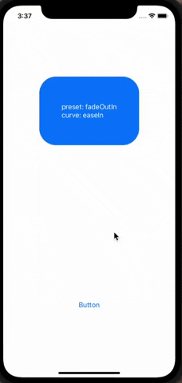

# AnimationViewApp

## Учебный проэкт
Проэкт демонстрирует view , которое появляется на экране с различной анимацией, при нажатии на кнопку.
Надпись на кнопке заменяется на название следующей анимации, которая будет применена к view (анимация определяется рандомно).

## Educational project
The project demonstrates a view that appears on the screen with various animations when a button is clicked.
The label on the button is replaced with the name of the next animation that will be applied to the view (the animation is determined randomly).

